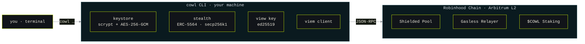
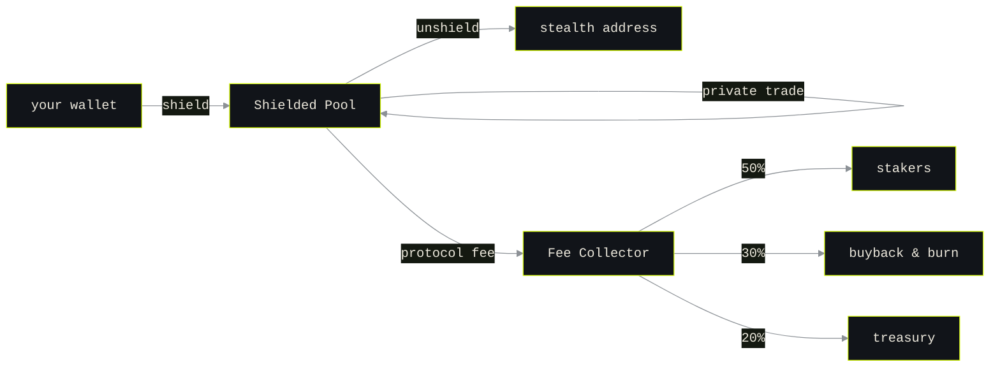

<div align="center">

# @cowlprotocol/cli

**Private trading on Robinhood Chain — from your terminal.**

[](https://cowlprotocol.com)
[](https://www.typescriptlang.org)
[](https://soliditylang.org)
[](https://nodejs.org)
[](https://viem.sh)
[](https://cowlprotocol.com/docs/shielded-pool)
[](https://www.npmjs.com/package/@cowlprotocol/cli)
[](./LICENSE)

</div>

Terminal CLI for [Cowl Protocol](https://cowlprotocol.com) — private trading on Robinhood Chain.
Manage a local wallet, generate one-time **stealth addresses**, hold **view keys** for selective
disclosure, shield and move funds privately, run a **relayer**, and check the **fee** schedule —
all from your terminal. Live on the Robinhood Chain testnet pool today: `shield`, private `send`, private `trade`, and
`unshield` all settle on chain, proven with ZK on your machine, with amounts crossing the boundary
in shared denominations and relayers keeping your wallet off the gas trail.

## How it works



Keys never leave your machine. The CLI signs locally and talks to the chain over JSON-RPC.

## Private trading & fees



Your book stays off the public explorer; fees flow back to stakers, the burn, and the treasury.
See [fee structure](https://cowlprotocol.com/docs/fee-structure) ·
[fee collector](https://cowlprotocol.com/docs/fee-collector).

## Install

```bash
npm install -g @cowlprotocol/cli
```

Requires **Node.js 18+**. The command is `cowl`.

---

## Quick start

```bash
cowl init                 # create a wallet + view key, pick a network
cowl                      # quick status overview (offline)
cowl faucet               # where to get testnet funds
cowl balance              # read your on-chain balance
cowl address              # fresh stealth address to receive privately
cowl fees                 # protocol fee schedule
cowl ping                 # RPC connectivity check
```

Everything lives in `~/.cowl/` (private, mode `0600`). Nothing leaves your machine unless you
broadcast a transaction.

---

## Wallet

A local, encrypted EVM keystore. Your key is sealed with a passphrase (scrypt + AES-256-GCM) and
never stored in plaintext.

A new wallet can be backed by a **12-word seed phrase** or by a **private key** alone. The phrase is
easier to write on paper and opens the same account in MetaMask or Rabby, since it derives at the
standard path `m/44'/60'/0'/0/0`. It is stored encrypted beside the key so it can be shown again.

```bash
cowl init                       # guided setup: new or import, phrase or key, passphrase, network
cowl wallet new                 # asks which backup you want
cowl wallet new --mnemonic      # 12-word seed phrase
cowl wallet new --key           # private key only

cowl wallet import "word word …"   # import a seed phrase
cowl wallet import 0x…             # import a private key
cowl wallet address                # print your address

cowl wallet export              # reveal the private key (asks to confirm)
cowl wallet export --mnemonic   # reveal the seed phrase
cowl wallet passphrase          # rotate the keystore passphrase
```

A private key cannot be turned back into a seed phrase. A wallet created from a raw key never gains
one; to hold a phrase, create a new wallet and move your funds.

---

## Stealth addresses

ERC-5564-style stealth addresses over secp256k1. Each one is a fresh, unlinkable destination that
only you can spend from. Spending and viewing keys are derived from your wallet, so addresses are
always recoverable from one seed.

```bash
cowl address                    # generate a one-time stealth address
cowl address --meta             # show your shareable stealth meta-address
```

---

## View keys

An ed25519 keypair for **selective disclosure**. Hand the public half to an auditor or tax
authority to grant read-only insight — and nothing more. The private half never leaves `~/.cowl`.

```bash
cowl viewkey show               # print your public view key
cowl viewkey new                # generate a new view key
```

---

## Balances & transfers

```bash
cowl balance                            # native balance
cowl balance --token 0x…                # ERC-20 balance

cowl send <amount> <token> <to>         # send funds (a stealth address works)
cowl send 0.01 ETH 0xRecipient…         # native transfer
cowl send 100 0xToken… 0xRecipient…     # ERC-20 transfer
```

---

## Networks & config

Robinhood Chain is an Arbitrum-based L2. Its public testnet (chainId `46630`, live since Feb 2026)
is the default, so reads, transfers, and connectivity are real today; mainnet (chainId `4663`) and
Arbitrum Sepolia are also built in. The official Robinhood RPC is geo-restricted in some regions,
so the default points at a globally-reachable endpoint — swap it any time. Everything is overridable.

```bash
cowl network                    # list networks (active is marked)
cowl network use <key>          # switch active network

cowl config show                # resolved network + contract addresses
cowl config set rpcUrl <url>    # override the RPC
cowl config set contracts.pool 0x…      # set a contract address once deployed
```

## Status & faucet

```bash
cowl                            # or `cowl status` — offline overview of wallet, network, contracts
cowl faucet                     # testnet faucet links for the active network + your address
```

Global flags: `--network <key>`, `--rpc <url>`, and `--json` (machine-readable output) work on
any command.

---

## Fees

```bash
cowl fees                       # protocol fee schedule + where fees go
```

See the docs for detail: [fee structure](https://cowlprotocol.com/docs/fee-structure) ·
[fee collector](https://cowlprotocol.com/docs/fee-collector).

---

## Portfolio

One view of everything you hold: what the explorer can see, and what it cannot.

```bash
cowl portfolio                  # public on-chain holdings + your shielded balance
cowl portfolio --public         # on-chain only
cowl portfolio --shielded       # shielded only

cowl token add 0x…              # track an ERC-20 (reads its symbol and decimals on-chain)
cowl token list                 # tracked tokens
cowl token remove 0x…
```

Positions are valued in USDG and the summary reports how much of your book sits off the explorer.
Native balance is always included; ERC-20s show up once you track them.

## Shielded pool

Your **private balance**. Funds you shield become **notes** — hidden UTXOs whose commitments live
in a Poseidon Merkle tree; spending one reveals only a **nullifier**, never the note. Balances are
computed locally by scanning for notes encrypted to your view key, so your book never touches the
public explorer.

```bash
cowl shield 0.1 ETH             # move funds into your shielded balance
cowl balance --shielded         # your private portfolio, grouped by token
cowl receive                    # your zcowl: payment address — share it to be paid privately
cowl send 0.05 ETH zcowl:0x…    # private, in-pool transfer to a zcowl: address
cowl trade 0.3 USDG             # privately swap your shielded balance for another token
cowl consolidate                # merge fragmented notes so any amount spends at once
cowl scan                       # find notes paid to you
cowl unshield 0.05 ETH          # move funds back out
```

### Denominations

Amounts that cross the pool boundary travel in **shared denominations** by default — 0.001 · 0.01
· 0.1 · 1 · 10 — so a deposit or withdrawal never carries a one-of-a-kind number that can be
matched across the boundary. Every 0.1 looks like every other 0.1, and everyone using a tier is
cover for everyone else in it. A larger amount fans out into a short sequence of transactions with
one confirmation and randomized gaps between them; amounts below the smallest tier stay where they
are. Add `--exact` to move the precise amount in a single transaction instead, or `--spread <window>`
(`45s`, `20m`, `3h`) to scatter the sequence across a window you choose so it leaves no tight
timeline on chain.

### Relayers

A relayer submits your proven spend from its own wallet and earns a fee bound into the proof, so it
can redirect nothing and your wallet never surfaces as the gas payer. On Robinhood Chain testnet,
withdrawals, private sends, and trades route through the Cowl relayer by default, so a fresh install
is private at the boundary out of the box. The plan and its confirmation always show the relayer and
its fee before you sign. Add `--self` to submit it yourself, or `--relay <url>` to use a different one.

```bash
cowl unshield 0.1                                  # routed through the default relayer
cowl unshield 0.1 --self                           # submit it yourself instead
cowl unshield 0.1 --relay https://your-relayer     # route through a specific relayer
cowl relay serve                                   # turn this wallet into a relayer, earn each spend's fee
cowl relay quote https://relay.cowlprotocol.com    # ask a relayer its price per spend
```

### Consolidation

A join-split spends at most two notes at once, so a balance scattered across many small notes caps
what a single transfer can move. `cowl consolidate [token]` merges the two smallest each round until
your balance sits in one — `n` notes settle in `n − 2` private spends, each proven on your machine
like any other.

```bash
cowl consolidate                # merge your native-token notes
cowl consolidate 0x…            # merge a specific ERC-20's notes
```

### Private trades

A private trade spends a shielded note of one token and returns a shielded note of another in **one
atomic transaction**: your input unshields into the trade adapter, swaps through public liquidity for
exactly the amount you ask to receive, and shields straight back under a commitment only your keys can
open. That a swap happened is public; who traded is not — your wallet never appears, and behind a
relayer and shared trade sizes the trade is unlinkable to you. Any other write to the pool mid-trade
reverts the whole thing, so a trade completes end to end or never happened.

`amount` is what you want to **receive**; `token` is the native symbol, `USDG`, or an ERC-20 address.

```bash
cowl trade 0.3 USDG                          # receive exactly 0.3 USDG from your shielded balance
cowl trade 0.001 ETH                         # receive 0.001 ETH for the counter-asset
cowl trade 0.3 USDG --max 0.0002 ETH         # cap what you are willing to spend
cowl trade 0.3 USDG --relay http://…:4663    # a relayer submits and pays the gas, not you
```

Trades travel in shared sizes by default — the same denominations the boundary uses — so one trade
looks like the next; `--exact` opts out. Any surplus under `--max` tips the submitter, never you.

### What settles on chain, and what does not

The note format (Poseidon2 commitments and nullifiers over the BN254 field) is the exact witness the
Noir circuits prove over. On networks where the pool contract is deployed:

**`cowl shield` is real.** It generates an UltraHonk proof on your machine — no toolchain to
install, the prover ships with the CLI — sends it to the pool contract, and the deposit settles on
chain. Your leaf index comes from the contract, and `balance --shielded`, `portfolio` and `scan`
rebuild the commitment tree from the pool's event log.

**`unshield` and private `send` are real too.** Each is a join-split: one proof spends up to two
notes and appends exactly two, proven on your machine and verified by the pool before anything
moves. The chain learns two nullifiers, two opaque commitments, and — only when value actually
leaves the pool — the public leg. Change comes back as a fresh note only your keys can find, and
spent notes are marked from the pool's own log, never guessed.

**`trade` settles on chain too.** One atomic transaction unshields your input to the trade adapter,
swaps it for exactly the output you asked for, and shields that output straight back — the spend
proof and the shield proof built as a chained pair on your machine and verified back to back by the
pool. Revert anywhere along the way and nothing moved.

On networks with no pool contract, the full flow — shield, send, trade, unshield — runs as a local
simulation: the cryptography is real and value is conserved, but nothing settles. Point a shared
pool file with `COWL_POOL_DIR` to try a multi-party flow locally.

```bash
cowl stake <amount>             # stake $COWL (lights up when the staking contract deploys)
```

---

## File locations

```
~/.cowl/
  keystore.json     # encrypted EVM key   (scrypt + AES-256-GCM, mode 0600)
  viewkey.json      # ed25519 view key    (mode 0600)
  config.json       # network + overrides (mode 0600)
  shielded/
    pool-<net>.json   # shielded-pool ledger (commitments, nullifiers, sync cursor)
    notes-<net>.json  # your discovered notes
```

Environment overrides: `COWL_HOME` (data directory), `COWL_POOL_DIR` (shared pool ledger),
`COWL_PASSPHRASE` (non-interactive unlock for scripting/CI — never echoed).

---

## Backup & security

Two things on your machine cannot be recomputed: the **keystore** (it is your wallet) and the
**view key** (it is generated randomly). Shielded notes are not in that list — every note key
descends from your wallet key, so `cowl scan` rebuilds them from the pool.

```bash
cowl backup ~/cowl-backup.json          # encrypted bundle: keystore + view key + config
cowl backup --verify ~/cowl-backup.json # prove it opens before you trust it
cowl restore ~/cowl-backup.json         # bring a wallet back on any machine

cowl wallet passphrase                  # rotate the keystore passphrase
cowl doctor                             # audit file permissions and setup
cowl wallet export                      # reveal the raw private key (last resort)
```

The backup is sealed under its own passphrase with scrypt + AES-256-GCM, so it is safe to keep off
the machine. Verify a backup before you rely on it: one that has never been restored is not a backup.

- Keys are encrypted at rest with a passphrase; the passphrase is never stored, and there is no
  recovery path if you forget it.
- Weak passphrases are called out when chosen. A stolen keystore is attacked offline, where short
  passphrases fall quickly.
- Never run `cowl wallet export` while screen sharing or recording.
- The CLI is non-custodial. You hold your keys; no server can move your funds.
- This is testnet-first software. Do not point it at mainnet funds until the protocol is audited
  and live. See the [disclaimer](https://cowlprotocol.com/disclaimer).

---

## Testing

`cowl` is tested by hand against the live Robinhood Chain testnet, and the results are written down
instead of summarised. [TESTING.md](./TESTING.md) is that log: 74 checks across eight groups, every
issue they turned up, and what closed each one. Two tests are still marked partial, and it says so.

Two of the issues are worth reading even if you never install this. One had a stealth meta-address
and a shielded payment address ending in the same bytes, so anyone holding both published addresses
could tie them to one person. The other let you sign an ERC-20 transfer whose confirmation screen
read `Amount 1 tokens`, without ever naming what was leaving your wallet.

---

## Links

- [Cowl Protocol](https://cowlprotocol.com) — website
- [Docs](https://cowlprotocol.com/docs)
- [Test log](./TESTING.md) — every check, run by hand on testnet
- [GitHub](https://github.com/Cowl-Protocol)

## License

MIT
